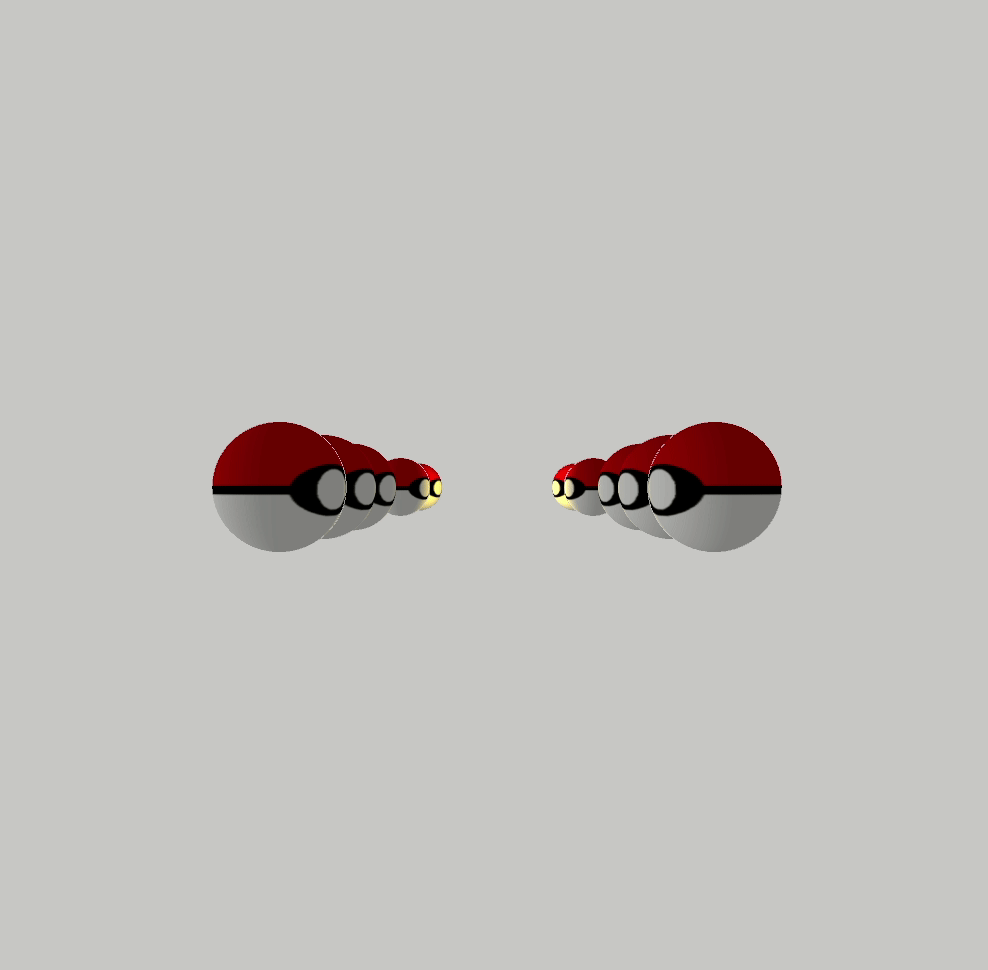

# CIU-Practica-5
## Autor

Aarón Adasat García Marrero - aaron.garcia104@alu.ulpgc.es

## Trabajo resultante
La descripcion del proyecto se establecia hacer uno de una camara, texturas y luces. Esta aplicacion se plantea una camara que se mueve hacia el infinito con una pokeballs a los lados si giramos la carama hacia la derecha se nos oscurecerian ya que la fuente de luz se encuentra en la izquierda, por tanto si giramos la camara hacia ese lado tendriamos una vision mas clara de estas. Además tenemos otra fuente de luz en el centro de las cuatro pokeballs situadas en el fondo, una luz amarilla

## Como ejecutar el proyecto

Principalmente hay un archivo raiz llamado [*Practica_5_CIU.pde*](Practica_5_CIU/Practica_5_CIU.pde) con abrir este fichero desde el IDE de processing y ejecutarlo tendriamos acceso a la aplicación

## Uso de la aplicación
El uso de la aplicacion es sencillo con ejecutar el programa podríamos ver el sistema planetario en acción. Pero a su vez tenemos unos controles básicos:

Movimiento de la camara: Flechas

Para cerrar la aplicacion solo tendríamos que pulsar la tecla ESC

## Referencias usadas

processing: https://processing.org/reference/

## GIF

